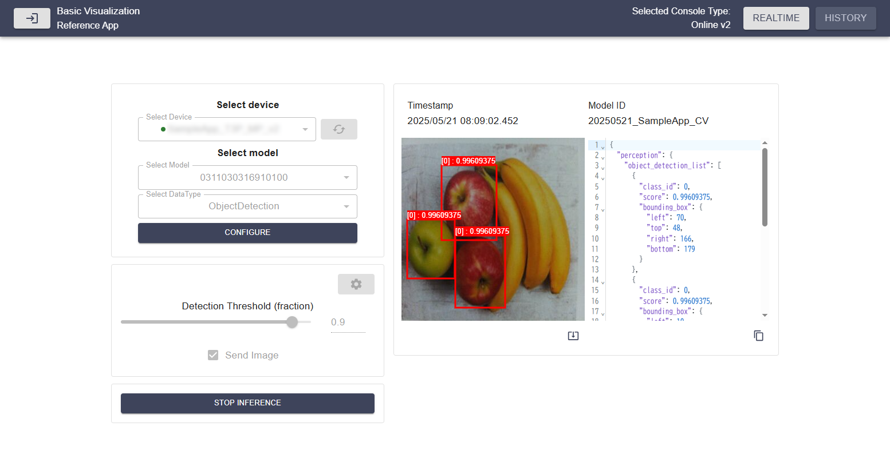
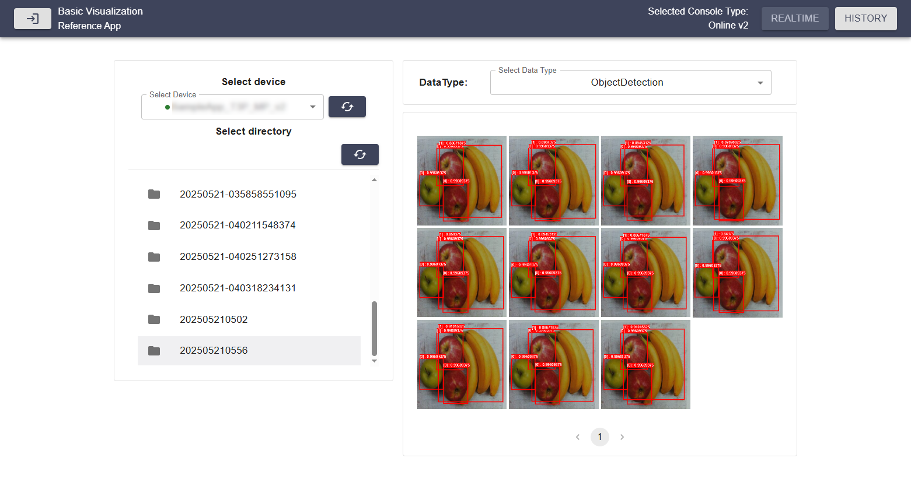
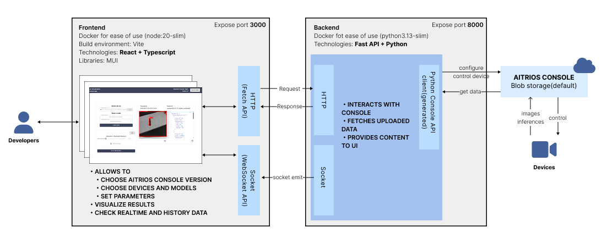

# aitrios-sample-application Basic Visualization

## Table of Contents

- [aitrios-sample-application Basic Visualization](#aitrios-sample-application-basic-visualization)
  - [Table of Contents](#table-of-contents)
  - [Overview](#overview)
  - [Project Structure](#project-structure)
    - [Directory and File Descriptions](#directory-and-file-descriptions)
  - [Verified Operating Systems \& Dependencies](#verified-operating-systems--dependencies)
  - [Getting Started](#getting-started)
    - [Prepare a device on AITRIOS Console](#prepare-a-device-on-aitrios-console)
      - [Create and deploy artifacts](#create-and-deploy-artifacts)
      - [Configure the Edge Application](#configure-the-edge-application)
    - [Check prerequisites for executing the Reference Solution](#check-prerequisites-for-executing-the-reference-solution)
      - [Docker and Docker Compose](#docker-and-docker-compose)
    - [Start Application on GitHub Codespaces](#start-application-on-github-codespaces)
    - [Local Installation](#local-installation)
      - [Running the Application](#running-the-application)
      - [Frontend](#frontend)
      - [Backend](#backend)
  - [Trademark](#trademark)
  - [Notice](#notice)
    - [Security](#security)

## Overview

This repository provides a reference implementation of a full solution using AITRIOS™. Building up on top of an existing AI model and Edge app, this reference solution implements object detection and classification solutions.
It consists of a Backend that interacts with Console for AITRIOS using the Console's REST API that is paired with a UI that retrieves the meta-data from the Console for AITRIOS and displays the image together with the detected objects.




## System Diagram



## Project Structure

The repository is organized as follows:
```
├── .devcontainer/
├── .vscode/
├── backend/
├── frontend/
└── docs/
```

### Directory and File Descriptions

#### `.devcontainer`

This directory contain the files necessary to run this project in a development container (dev container), be it in **GitHub Codespaces** or **Visual Studio Code**.
More details how to use it are provided in the [USAGE.md](./docs/USAGE.md) document.

#### `.vscode/`

This directory contains the [**`launch.json`**](./.vscode/launch.json) file with configuration for a debugger in Visual Studio Code.

#### `backend/`

Contains the backend application built with FastAPI.
For more details on this directory's structure, check its [**`README.md`**](./backend/README.md).

#### `frontend/`

This directory contains the frontend built with React and TypeScript.
For more details on its structure, check its [**`README.md`**](./frontend/README.md).

#### `docs/`

This directory contains project documentation.

## Verified Operating Systems & Dependencies

The application has been tested and verified to work with:

- **Operating Systems:** Ubuntu 22.04
- **Python:** 3.13
- **Node.js:** 20


## Getting Started

To get started with the Basic Visualization Application, follow the steps below.

### Prepare a device on AITRIOS Console

To run this reference solution you need to have a CSV26 camera to be enrolled to your project in the AITRIOS Console. In addition, it should have deployed a object detection/classification Edge application and a compatible AI model for each solutions. These artifacts should first be obtained locally, then imported to the Console and finally be deployed on device.

> _Note_ </br>
> For basic device and console operation, please refer to the [**Device Setup Guide**](https://developer.aitrios.sony-semicon.com/en/edge-ai-sensing/documents/device-setup-guide/) and [**Console User Manual**](https://developer.aitrios.sony-semicon.com/en/edge-ai-sensing/documents/console-user-manual/).

#### Create and deploy artifacts

The reference solution requires a model and an edge application to be deployed on the device. In some cases, the process for obtaining and deploying these artifacts varies between versions of Console for AITRIOS, V1 and V2. When applicable, such difference is directly indicated in further description.

##### AI Model

- By using CustomVision provided by the AITRIOS Console, you can create AI models that can be used for Object Detection inference. To create AI models using CustomVision, refer to the [**Deployment Guide for Custom Vision AI Model**](https://developer.aitrios.sony-semicon.com/en/edge-ai-sensing/documents/console-v2/deployment-guide-for-custom-vision-ai-model).

  > **NOTE**<br>
  > This application supports the Classification interface; however, Classification models cannot be created using CustomVision now.

##### Edge Application

- In order to get the Edge Application, check the [**Downloads**](https://developer.aitrios.sony-semicon.com/en/edge-ai-sensing/downloads). Please select  from V1 or V2 according to the Console you wish to use. You will obtain an Edge Application that will need to be imported to the AITRIOS Console and then deployed to the device.

  > **NOTE**<br>
  > Note that for V1 the Edge Application artifact would be a single file of type `.wasm`/`.aot`, while V2 would result in an Edge Application Package.

-  For instructions on how to import an Edge Application into **Console**, and how to deploy it to the device check [**Console User Manual**](https://developer.aitrios.sony-semicon.com/en/edge-ai-sensing/documents/console-user-manual/).


#### Configure the Edge Application

**v1: Import and Bind Command Parameter File**

To control the device's inference operation, a Command Parameter file must be bound to the device. While a user can provide an initial command parameter file themselves through the Console, it is not necessary since the current application automatically creates a new Command Parameter file and binds it to a selected device in case when no initial is available. [**Console User Manual**](https://developer.aitrios.sony-semicon.com/en/edge-ai-sensing/documents/console-user-manual/) provides instructions on importing Command Parameter file into **Console**, and on binding Command Parameter to the device.

**v2: update Edge Application state with DTDL**

Starting from version 2, AITRIOS is using DTDL (short for "Digital Twins Definition Language") to define the Edge Application Interface. While there
are numerous configurations, the reference solution requires only some of them to be specified. In particular, one has to correctly configure the port settings that define methods and a storage for the upload of the edge application output. They correspond to the content of the field `edge_app.common_settings.port_settings`.

To do so, you first need to obtain the ID of your project (`YOUR_PROJECT_ID`) from AITRIOS Portal and specify it in the "storage_name" for the "input_tensor" field. You can find `YOUR_PROJECT_ID` in the browser url on the website of the portal, after logging in and selecting a project. The browser url takes the form `PORTAL_URL/project/YOUR_PROJECT_ID/marketplace/product`.

You can then apply the following configuration to the Edge Application deployed on Console.
```json
{
  "edge_app": {
    "common_settings": {
      "port_settings": {
        "metadata": {
          "path": "",
          "method": 0,
          "enabled": true,
          "endpoint": "",
          "storage_name": ""
        },
        "input_tensor": {
          "path": "YOUR_DEVICE_ID/image/FOLDER_NAME",
          "method": 1,
          "enabled": true,
          "endpoint": "",
          "storage_name": "YOUR_PROJECT_ID"
        }
      }
  }
}
```

> **Note**<br/>
> For general details on the Edge Application interface, check the [Edge Application Interface JSON Specification](https://developer.aitrios.sony-semicon.com/en/edge-ai-sensing/documents/console-v2/edge-application-interface-json-specification) page on the AITRIOS developer website. Pay attention to the [`port_settings` subsection](https://developer.aitrios.sony-semicon.com/en/edge-ai-sensing/documents/console-v2/edge-application-interface-json-specification?progLang=#_portsettingsSpec) <br/>
> For details on the custom settings for the Edge Application, check its [README.md](https://github.com/SonySemiconductorSolutions/aitrios-sdk-edge-app/tree/main/sample_apps/detection#custom-parameters).

### Check prerequisites for executing the Reference Solution

Ensure you have the following installed on your system:

#### Docker and Docker Compose

These are necessary to run the application in a containerized environment.

Below are the links to the instructions on how to install both `Docker` and `Docker Compose` in most common operating systems:
- **Linux (Ubuntu)**: See instructions [here](https://docs.docker.com/engine/install/ubuntu/).
- **Linux (other distributions)**: See instructions [here](https://docs.docker.com/engine/install/).
- **Windows**: See instructions [here](https://docs.docker.com/desktop/setup/install/windows-install/).
- **macOS**: See instructions [here](https://docs.docker.com/desktop/setup/install/mac-install/).


### Start Application on GitHub Codespaces

1. **Clone or Fork**: Clone or fork this repository into your GitHub account.

2. **Create a Codespace**:
   - Navigate to the cloned/forked repository.
   - Click the "+" button to create a codespace.
   - For more details, see [How to Create a Codespace](https://docs.github.com/en/codespaces/developing-in-a-codespace/creating-a-codespace-for-a-repository).

3. **Access and Monitor**:
   - The application will start automatically once the setup completes.
   - To view deployment logs, press `Ctrl + Shift + P` (or `Cmd + Shift + P` on Mac) and select "View Creation Logs."

4. **Open Application**:
   - Use the URL displayed under frontend port 3000 in the "Ports" tab to access your application.


### Local Installation

**Clone the repository**:

```bash
git clone git@github.com:SonySemiconductorSolutions/aitrios-sample-application-basic-visualize-data.git
cd aitrios-sample-application-basic-visualize-data
```

#### Running the Application

To run the full application, use the provided Docker Compose setup:

```bash
docker compose up
```

To run only the backend or frontend separately, execute:


```bash
docker compose up backend
```
```bash
docker compose up frontend
```

>  **Note**</br>
> This approach doesn't support debugging. To run app in the debugging mode you should start frontend and backend separately.

#### Frontend

For more detailed usage instructions, see the [frontend README](./frontend/README.md#usage).

#### Backend

For more detailed usage instructions, see the [backend README](./backend/README.md#usage).

## Trademark

- [Read This First](https://developer.aitrios.sony-semicon.com/en/edge-ai-sensing/documents/read-this-first)

## Notice

### Security

Before using Codespaces, please read the Site Policy of GitHub and understand the usage conditions.
