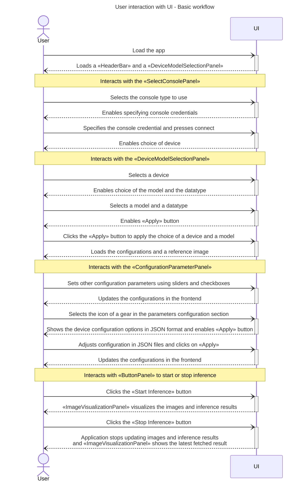
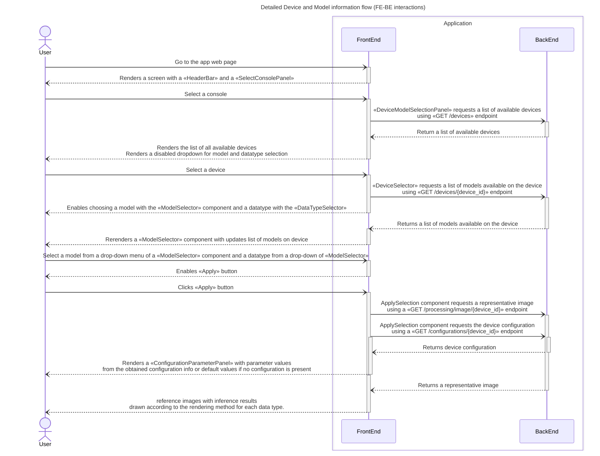
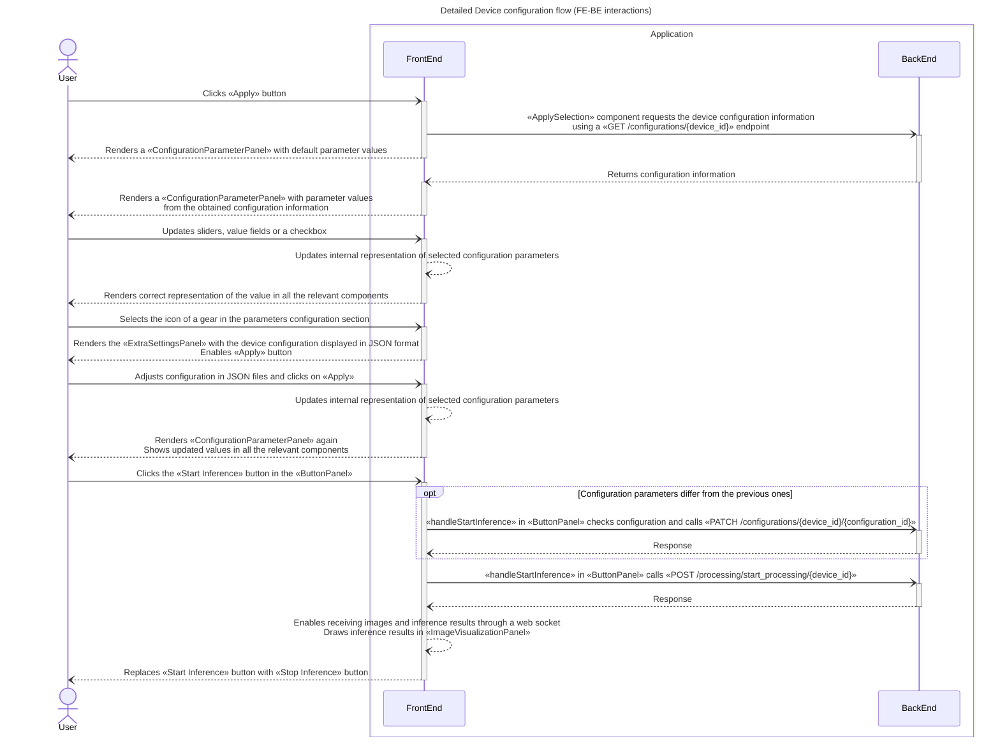
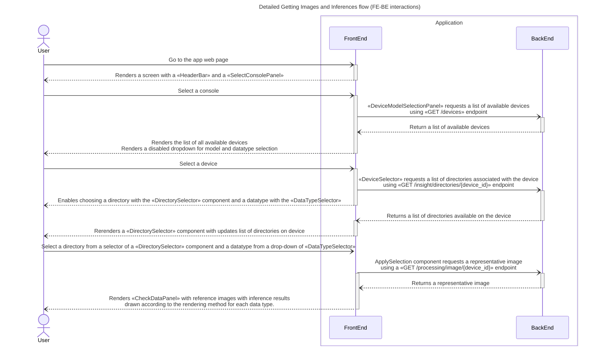

# Interaction logic between user interface and backend

This document explains the workflow of using the web application in the form of sequence diagrams. We start by listing the available panels. Then we explain the basic workflow of connecting to the console and selecting and starting an application on a device.
Finally we explain interactions provided by additional panels of the application.

## UI Panels

The UI consists of the following panels that can be found in their corresponding files of the various [components] folders:
- [`src/components`](../frontend/app/src/components/)
- [`src/features/login-screen/components`](../frontend/app/src/features/login-screen/components)
- [`src/features/basic-visualization/components`](../frontend/app/src/features/basic-visualization/components)
- [`src/features/basic-visualization/realtime-mode/components`](../frontend/app/src/features/basic-visualization/realtime-mode/components)
- [`src/features/basic-visualization/history-mode/components`](../frontend/app/src/features/basic-visualization/history-mode/components)

List of panels:
- [`HeaderBar`](../frontend/app/src/components/HeaderBar.tsx) -- a panel with the name of the app, selected console type and buttons to shift between System Health and the Main View. Also, it contains a button to return to Console selection.
- [`SelectConsolePanel`](../frontend/app/src/features/login-screen/components/SelectConsolePanel.tsx) -- a panel to select which console to use.
- [`OnlineCredentialsPanel`](../frontend/app/src/features/login-screen/components/OnlineCredentialsPanel.tsx) -- a panel to introduce the log in credentials for the online consoles.
- [`DeviceModelSelectionPanel`](../frontend/app/src/features/basic-visualization/realtime-mode/components/DeviceModelSelectionPanel.tsx) -- a panel for choosing a device, and one of the models currently deployed on it.
- [`ButtonPanel`](../frontend/app/src/features/basic-visualization/realtime-mode/components/ButtonPanel.tsx) -- a panel that contains buttons to Start/Stop inference.
- [`ImageVisualizationPanel`](../frontend/app/src/features/basic-visualization/realtime-mode/components/ImageVisualizationPanel.tsx)-- a panel to visualize inference results.
- [`ExtraSettingsPanel`](../frontend/app/src/features/basic-visualization/realtime-mode/components/ExtraSettingsPanel.tsx) -- a panel to visualize and edit the device values in a JSON manner.
- [`ConfigurationParameterPanel`](../frontend/app/src/features/basic-visualization/realtime-mode/components/ConfigurationParameterPanel.tsx) -- a panel for displaying and adjusting the configuration parameters of the app.
- [`DeviceDirectorySelectionPanel`](../frontend/app/src/features/basic-visualization/history-mode/components/DeviceDirectorySelectionPanel.tsx) -- a panel for choosing a device, and one of the directories associated with the device.
- [`CheckDataPanel`](../frontend/app/src/features/basic-visualization/history-mode/components/CheckDataPanel.tsx) -- a panel that draws and lists inference results on images in the image directory

## User interaction with UI - basic workflow

The current web application allows to
- connect to a console
- select a device and a detection model
- perform inference
- set configuration parameters (such as thresholds) for a previously deployed edge application and to
- visualize the inference results in the form of an image.

The basic workflow is as follows:

## Detailed Device and Model information flow (FE-BE interactions)

This sections describes the detailed flow of information to select the console, device, model and edge application to use. These interactions are contained in the [`DeviceModelSelectionPanel`](../frontend/app/src/features/basic-visualization/realtime-mode/components/DeviceModelSelectionPanel.tsx) and its components. Once the user selects a console and sets the credentials, this panel allows them to select a device and a model previously deployed on this device. Once the selection is accepted, the application fetches an image and the device configuration, and displays them in the `ImageVisualizationPanel` and `ConfigurationParameterPanel` respectively.

Child components of `DeviceModelSelectionPanel`:
- [*ApplySelection.tsx*](../frontend/app/src/features/basic-visualization/realtime-mode/components/ApplySelection.tsx)
- [*DeviceSelector.tsx*](../frontend/app/src/features/basic-visualization/realtime-mode/components/DeviceSelector.tsx)
- [*ModelSelector.tsx*](../frontend/app/src/features/basic-visualization/realtime-mode/components/ModelSelector.tsx)
- [*DataTypeSelector.tsx*](../frontend/app/src/features/basic-visualization/realtime-mode/components/DataTypeSelector.tsx)

Endpoints used by `DeviceModelSelectionPanel` and its children:
- [*Router* `/device`](../backend/app/routers/device.py)
  - `GET /devices/`
  - `GET /devices/{device_id}`
- [*Router* `/configuration`](../backend/app/routers/configuration.py)
  - `GET /configurations/{device_id}`
- [*Router* `/processing`](../backend/app/routers/processing.py)
  - `GET /processing/image/{device_id}`

FE-BE interaction is implemented in:
- [*DeviceInfoFromConsole.tsx*](../frontend/app/src/utils/DeviceInfoFromConsole.tsx)
- [*EdgeAppConfigurationFromConsole.tsx*](../frontend/app/src/utils/EdgeAppConfigurationFromConsole.tsx)
- [*GetImageFromConsole.tsx*](../frontend/app/src/utils/GetImageFromConsole.tsx)

## Detailed Device configuration flow (FE-BE interactions)

This sections describes the flow to interact with the Device/Application configurations. These interactions are contained in the `ConfigurationParameterPanel`. This panel displays the configuration parameters of an Edge Application that a user can change from UI, which includes sliders and checkboxes for some of the parameters. All the changes performed on this panel are stored in the Frontend and are only passed to the Backend upon pressing the button "Start Inference" in the `ButtonPanel`.

This panel is first rendered with the default values and is blocked for change while the application is receiving and parsing the device configuration information. Upon its completion, the components are rendered again with the values obtained, and only then the frontend enables modifying its values.

Child components of `ConfigurationParameterPanel`:
- [*CustomCheckBox.tsx*](../frontend/app/src/components/CustomCheckBox.tsx)
- [*CustomSlider.tsx*](../frontend/app/src/components/CustomSlider.tsx)

## Detailed Getting Images and Inferences flow (FE-BE interactions)

This sections describes the detailed flow of information to select the device, image directory and datatype to list images associated with the device. These interactions are contained in the [`DeviceDirectorySelectionPanel`](../frontend/app/src/features/basic-visualization/history-mode/components/DeviceDirectorySelectionPanel.tsx) and its components. This panel allows them to select a device and a directory created on Console. Once the selection is accepted, the application fetches an images and inference results, and displays them in the `CheckDataPanel`.

Child components of `DeviceDirectorySelectionPanel`:
- [*DeviceSelector.tsx*](../frontend/app/src/features/basic-visualization/history-mode/components/DeviceSelector.tsx)
- [*DirectorySelector.tsx*](../frontend/app/src/features/basic-visualization/history-mode/components/DirectorySelector.tsx)
- [*DataTypeSelector.tsx*](../frontend/app/src/features/basic-visualization/history-mode/components/DataTypeSelector.tsx)

Endpoints used by `DeviceDirectorySelectionPanel` and its children:
- [*Router* `/device`](../backend/app/routers/device.py)
  - `GET /devices/`
- [*Router* `/insight`](../backend/app/routers/insight.py)
  - `GET /insight/directories/{device_id}`
  - `GET /insight/images_and_inferences/{device_id}/{sub_directory_name}`

FE-BE interaction is implemented in:
- [*DeviceInfoFromConsole.tsx*](../frontend/app/src/utils/DeviceInfoFromConsole.tsx)
- [*ImagesAndInferencesFromConsole.tsx*](../frontend/app/src/utils/ImagesAndInferencesFromConsole.tsx)

## ButtonPanel

This panel serves to collect together buttons of *Start inference* and *Stop inference*.

Endpoints used by `ButtonPanel` and its children:
- [*Router* `/configuration`](../backend/app/routers/configuration.py):
  - `PATCH /configurations/{file_name}`
- [*Router* `/processing`](../backend/app/routers/processing.py):
  - `POST /processing/start_processing/{device_id}`
  - `POST /processing/stop_processing/{device_id}`

FE-BE interaction for this panel is implemented in:
- [*EdgeAppConfigurationFromConsole.tsx*](../frontend/app/src/utils/EdgeAppConfigurationFromConsole.tsx)
- [*ProcessingService.tsx*](../frontend/app/src/utils/ProcessingService.tsx)

## ImageVisualizationPanel

This panel visualizes images from the camera, and draws inference results into an image according to the data type of the model.

Child components of `ImageVisualizationPanel`:
- [*Canvas.tsx*](../frontend/app/src/features/basic-visualization/realtime-mode/components/Canvas.tsx)

Endpoints used by `ImageVisualizationPanel` and its children:
- [*Router* `/processing`](../backend/app/routers/processing.py)
  - Connection to a `/ws`

FE-BE interaction for this panel is implemented in:
- [*ImageStream.tsx*](../frontend/app/src/utils/ImageStream.tsx)

## SelectConsolePanel
This panel allows the user to select which Console to use, from among the listed ones.

Endpoints used by `SelectConsolePanel` and its children:
- [*Router* `/connection`](../backend/app/routers/connection.py)
  - `GET /connection`
  - `PUT /connection`
- [*Router* `/client`](../backend/app/routers/client.py)
  - `GET /client`

FE-BE interaction for this panel is implemented in:
- [*ConsoleConfiguration.tsx*](../frontend/app/src/features/login-screen/utils/ConsoleConfiguration.tsx)

## OnlineCredentialsPanel
This panel allows the user to specify the configuration options required to access any type of Online Console. These options include which endpoints to use, as well as the Client credentials.

Endpoints used by `OnlineCredentialsPanel` and its children:
- [*Router* `/connection`](../backend/app/routers/connection.py)
  - `GET /connection`
  - `PUT /connection`
- [*Router* `/devices`](../backend/app/routers/device.py)
  - `GET /devices`

FE-BE interaction for this panel is implemented in:
- [*DeviceInfoFromConsole.tsx*](../frontend/app/src/utils/DeviceInfoFromConsole.tsx)

## DeviceModelSelectionPanel
This model allows the user to select Device and Model from those available in the selected Console. Initially, only the Device selection is enabled, and once the user has selected a Device, the Model selection is enabled as well, listing all the models in the device.

Endpoints used by `DeviceModelSelectionPanel` and its children:
- [*Router* `/devices`](../backend/app/routers/device.py)
  - `GET /devices/{device_id}`

FE-BE interaction for this panel is implemented in:
- [*DeviceInfoFromConsole.tsx*](../frontend/app/src/utils/DeviceInfoFromConsole.tsx)

## ExtraSettingsPanel
This panel allows the user to visualize and edit the device configuration values in a JSON manner. The exact format of the configuration will depend on various factors, such as the type of Console used or the device selected.

This panel does not communicate with the Backend. The updates in the configuration are stored locally, and communicated to the Backend with starting inference using the [*ButtonPanel*](#buttonpanel).

## ConfigurationParameterPanel
This panel allows the user to visualize and edit the device configuration values using sliders and checkboxes. The list of editable values is hardcoded in the Sample Application, and it's independent of the Console selection.

This panel does not communicate with the Backend. The updates in the configuration are stored locally, and communicated to the Backend with starting inference using the [*ButtonPanel*](#buttonpanel).
