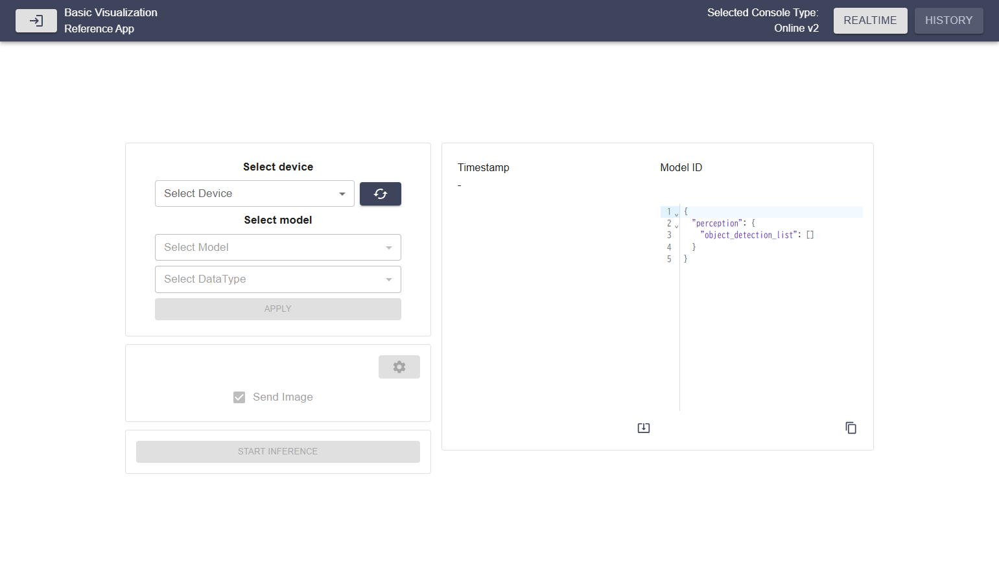
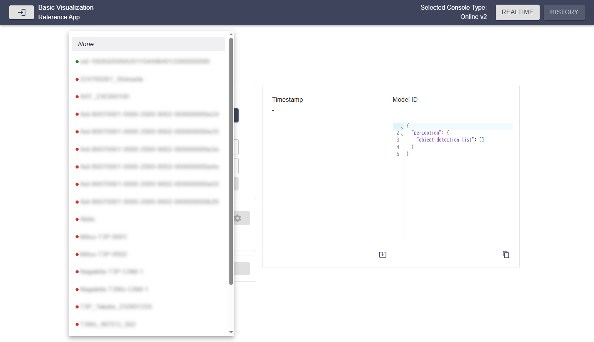
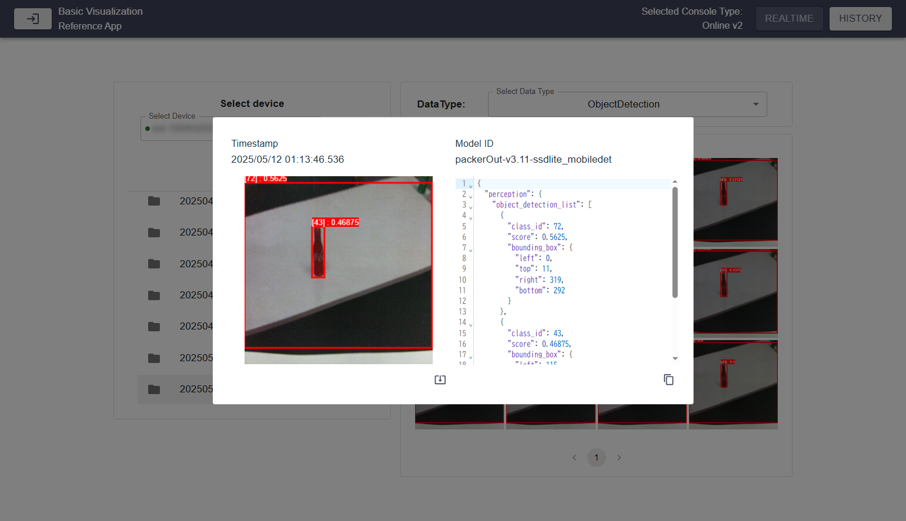

# Expected User Workflow

## 1. Open the Application
Follow the [USAGE.md](USAGE.md) guide to start the application.

## 2. Select AITRIOS Online Console Version
Upon launching, the landing page will prompt the user to select the AITRIOS Online Console version to use.

## 3. Enter Console Credentials
Once a console version is selected, the user must enter their credentials. Click **Apply** to submit the credentials.

## 4. Realtime mode
In Realtime mode, it starts inference of devices connected to the Console and acquires and displays real-time detection results.

## 4.1. Select Device, Model and DataType
- A **device** from the list of enrolled devices in the project.
- A **model** available on the selected device.
- An output **DataType** of the model selected above. Choose from ObjectDetection or Classification.

Click **Apply** to proceed to the **Realtime Mode** main view.

## 4.2. Adjust configurations
On the main page, users have multiple configuration options:

1. **Reconfigure** device and model selection via the **"Configure"** button.
1. **Adjust parameters** with sliders and value input boxes.
1. **Enable or disable image reception** using the **"Send Image"** checkbox.
1. **Access extra settings** using the ⚙️ button.
1. **Start inference on device** using **Start inference**.

## 4.3. Start Inference
To begin inference, click the **Start Inference** button.

## 4.4. Check realtime data
The inference result is drawn and displayed in the angle of view that the device is currently projecting. Inference results can be viewed in JSON format.

## 5. History mode
In History mode, retrieves images and inference results uploaded to the Console and displays the detection results.

## 5.1. Select Device, DataType and Image Directory
- A **device** from the list of enrolled devices in the project.
- A **directory** available on the selected device.
- An output **DataType** of the model used for inference. Choose from ObjectDetection or Classification.

## 5.2. Check history data
The inference results are drawn and displayed on the list of images the device has captured in the past.

## 5.3. Check specific data
Selecting one of the images opens a modal that allows you to see the timestamp of the image and the results of the inference.

